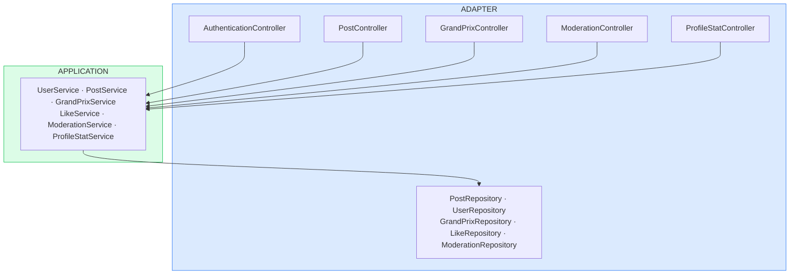

# Formula Fan — Backend


Social backend for Formula 1 fans. Spring Boot 3.2 · Java 21 · JWT stateless auth · MariaDB.
Posts per Grand Prix, likes, ADMIN moderation, and user profiles.
Shared REST API serving a [companion mobile app](https://github.com/edvardFH/FormulFan) *(separate repo, built by the same author)* and an independent web client.

---

## Architecture Overview



Two-layer structure. **ADAPTER** owns all HTTP and persistence concerns: REST controllers, request/response DTOs, JPA entities, and Spring Data repositories. **APPLICATION** owns all business logic: services and custom exceptions, with no dependency on HTTP constructs or JPA annotations.

## Layered Architecture

| Layer | Package | Responsibilities |
|---|---|---|
| ADAPTER | `adapter/controller/` | REST controllers, request/response DTOs, `GlobalExceptionHandler` |
| ADAPTER | `adapter/persistence/` | JPA entities, Spring Data repository interfaces |
| APPLICATION | `application/service/` | Use-case services: post visibility, like rules, moderation logic |
| APPLICATION | `application/exception/` | Custom exceptions thrown by services, caught at the controller boundary |

APPLICATION services depend only on Spring Data interfaces injected via the constructor. No `HttpServletRequest`, no `@Entity`. Replacing the REST layer or the ORM touches the ADAPTER only.

---

## Architecture Decisions

### Simplified two-layer structure over full Clean Architecture

**Context:**
The application is CRUD-dominant. A dedicated Domain layer with value objects and rich aggregates would add indirection without commensurate benefit for this scope.

**Decision:**
Two concentric layers: APPLICATION for business rules, ADAPTER for REST and persistence. Entities live in the persistence package; business invariants (e.g. hidden post filtering, duplicate-like prevention) live in the service layer.

**Consequence:**
Less indirection. Business logic remains isolated from framework concerns and independently verifiable.

---

### Centralized REST API as the shared backend for a pervasive application

**Context:**
Two independent frontend teams needed access to the same data and rules: one building a native mobile app (Android, separate repo, same author), one building a web client (separate team). Duplicating logic across backends was ruled out.

**Decision:**
A single Spring Boot REST API acts as the canonical backend for all frontends. Both clients consume the same endpoints under the same JWT contract.

**Consequence:**
Business rules defined once. The API contract is the integration boundary. Frontend technology choices remain fully independent.

---

### Stateless JWT authentication

**Context:**
The API serves heterogeneous clients (mobile, web). Server-side session state would couple the API to HTTP sessions and complicate client-agnostic usage.

**Decision:**
Bearer token issued on login and validated on each request via a `OncePerRequestFilter`. No server-side session. Token validity: 24 h. Logout is a client-side concern.

**Consequence:**
API fully stateless and client-agnostic. No revocation mechanism. Token expiry is the only invalidation path.

---

## Getting Started

**Prerequisites:** JDK 21, Maven 3.9+, MariaDB 10+

```bash
# 1. Create the database
mysql -u root -p -e "CREATE DATABASE formula_fan_db;"

# 2. Configure credentials
#    Edit src/main/resources/application.yml -> spring.datasource.*

# 3. Clone and run
git clone https://github.com/edvardFH/FormulFanBackend.git
cd FormulFanBackend
mvn spring-boot:run
```

An admin account is seeded automatically at startup. Credentials in `application.yml` under `auth.admin.login`.

> **Note:** `ddl-auto: create-drop`. The schema is recreated on every restart. No migration tool (Flyway/Liquibase) is in place.

---

## Tech Stack

| Concern | Technology |
|---|---|
| Language | Java 21 |
| Framework | Spring Boot 3.2.5 |
| Security | Spring Security · JJWT 0.12.3 |
| Persistence | Spring Data JPA · MariaDB |
| Build | Maven |

---

## API Reference

Base URL: `http://localhost:8080`

All endpoints except `/api/v1/auth/**` require `Authorization: Bearer <token>`.
Moderation endpoints (`/api/v1/moderation/**`) require `ADMIN` role.

| Resource | Base path |
|---|---|
| Authentication | `POST /api/v1/auth/register` · `POST /api/v1/auth/login` |
| Posts | `GET/POST /api/v1/posts` · `GET /api/v1/posts/grand-prix/{id}` · `GET /api/v1/posts/user/{id}` |
| Likes | `POST /api/v1/posts/{id}/like` · `POST /api/v1/posts/{id}/unlike` |
| Grand Prix | `GET /api/v1/grand-prix` |
| Moderation | `POST /api/v1/moderation/hide` · `GET /api/v1/moderation/hidden-posts` |
| Stats | `GET /api/v1/stats/{userId}` |
